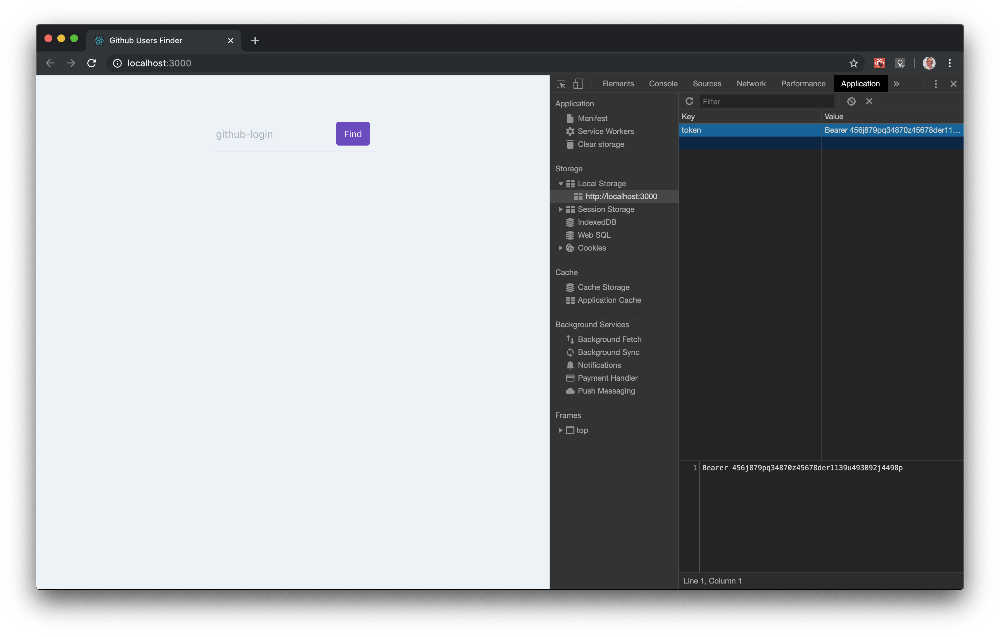

# React demo for Apollo Client v3.0-beta
Apollo Client is a complete state management library for JavaScript apps.

## This demo app
Fetches data from `github` [GraphQL API v4](https://developer.github.com/v4/)

In order to run it on your local box, you will need to set a valid `token` in your browser `Application Local Storage`


See [Creating a personal access token for the command line](https://help.github.com/en/github/authenticating-to-github/creating-a-personal-access-token-for-the-command-line) github guide!

## Goal
Help you understand the link between Hooks, Graphql/Apollo Client and the app state!

## Why Apollo Client?

simplicity | declarative | no boilerplate

https://www.apollographql.com/docs/react/v3.0-beta/why-apollo/


### Declarative data fetching
The logic for retrieving your `data`, tracking `loading` and `error` states, and updating your UI is encapsulated by the `useQuery` Hook:

src/components/UserInfo.js
```js
import { gql, useQuery } from "@apollo/client";

const GET_USER = gql`
  query getUser($login: String!) {
    user(login: $login) {
      login
      name
    }
  }
`;

function UserInfo(props) {
  const { loading, error, data } = useQuery(GET_USER, {
    variables: { login: props.login }
  });

  if (loading) return <p>Loading...</p>;
  if (error) return <p>Error :(</p>;

  return (
    <h2>{data.user.name}</h2>
  )
}

export default UserInfo;
```

### Simple or even Zero-config and normalized cache
One of the key features that sets Apollo Client apart from other data management solutions is its normalized `cache`.

src/index.js
```js
import {
  ApolloClient,
  HttpLink,
  InMemoryCache,
  ApolloProvider
} from "@apollo/client";

const client = new ApolloClient({
  link: new HttpLink({
    uri: "https://api.github.com/graphql",
    headers: {
      Authorization: localStorage.getItem("token")
    }
  }),
  cache: new InMemoryCache({
    typePolicies: {
      User: {
        keyFields: ["login"]
      }
    }
  })
});

ReactDOM.render(
  <ApolloProvider client={client}>
    <App />
  </ApolloProvider>,
  document.getElementById("root")
);
```

### Local state management
Apollo Client excels at managing remote data, which equates to roughly 80% of app data needs. But what about local data (like global flags and device API results) that make up the other 20% of the pie? Apollo Client includes local state management features out of the box!

In this example, we're querying the client-only field `selectedUser`

src/components/UserSelect.js
```js
import React from "react";
import { gql, useQuery } from "@apollo/client";
import UserInfo from "./UserInfo";

const GET_SELECTED_USER = gql`
  {
    selectedUser @client
  }
`;

function UserSelect(props) {
  const { data, client } = useQuery(GET_SELECTED_USER);

  const handleClick = () =>
    client.writeData({ data: { selectedUser: props.login } });

  return (
    <UserInfo
      login={props.login}
      onClick={handleClick}
      isSelected={data && data.selectedUser === props.login}
    />
  );
}

export default UserSelect;
```


# Available Scripts

In the project directory, you can run:

### `npm start`

Runs the app in the development mode.<br />
Open [http://localhost:3000](http://localhost:3000) to view it in the browser.

The page will reload if you make edits.<br />
You will also see any lint errors in the console.

### `npm test`

Launches the test runner in the interactive watch mode.<br />
See the section about [running tests](https://facebook.github.io/create-react-app/docs/running-tests) for more information.

### `npm build`

Builds the app for production to the `build` folder.<br />
It correctly bundles React in production mode and optimizes the build for the best performance.

The build is minified and the filenames include the hashes.<br />
Your app is ready to be deployed!

See the section about [deployment](https://facebook.github.io/create-react-app/docs/deployment) for more information.
